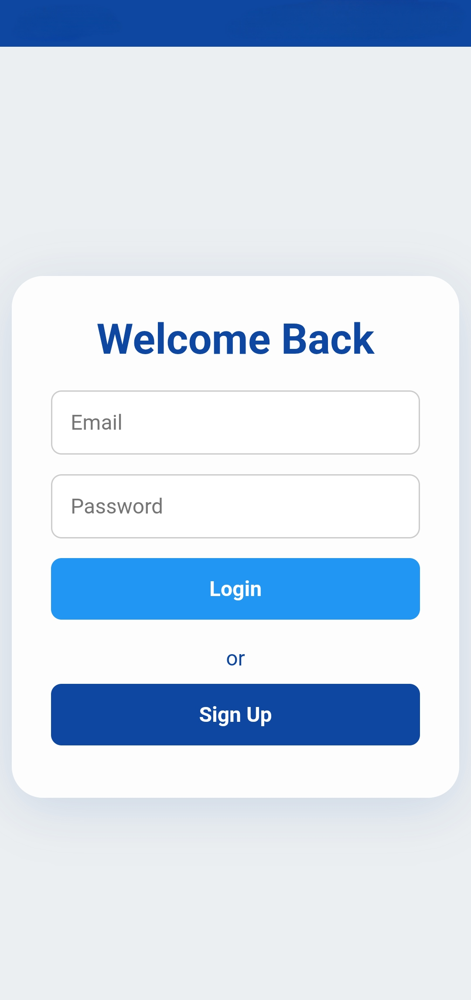
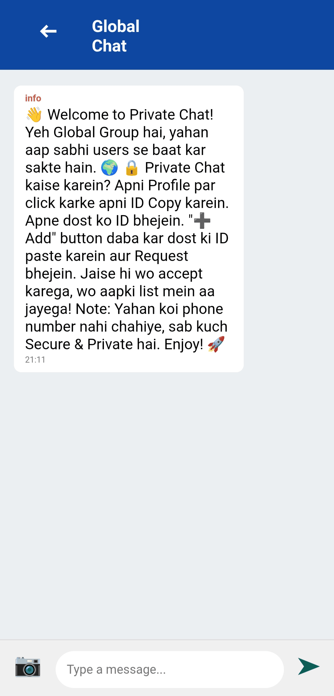

# 🔒 Private Chat App (PWA)

> A secure, real-time messaging Progressive Web App built focusing on privacy. Features Global Chat, Private Messaging via Unique IDs, and a beautiful Milky White Glassmorphism UI.

---

### 🔴 [**View Live Demo**](https://ayushraistudio.github.io/Private-chat/)

---

## 📸 Screenshots

| Login Screen | Global Chat | Profile & Add Friend |
| :---: | :---: | :---: |
|  |  |  |

## 🚀 Key Features

* **🌍 Global Group Chat:** Instantly connect with everyone in the main lounge.
* **🛡️ Private 1-on-1 Chat:** Secure messaging via a Friend Request system. No strangers.
* **🆔 Unique ID System:** Privacy-first approach. Add friends using unique UIDs instead of phone numbers.
* **📱 PWA Support:** Installable on Android/iOS home screen just like a native app.
* **🗑️ Advanced Delete:**
    * *Delete for Everyone* (For your own messages).
    * *Delete for Me* (Locally hide others' messages).
* **📷 Media Sharing:** Send compressed images securely.
* **🎨 Modern UI:** Clean Glassmorphism design with responsive layout.

## 🛠️ Tech Stack

* **Frontend:** HTML5, CSS3, Vanilla JavaScript (ES6 Modules)
* **Backend / Database:** Firebase Authentication & Realtime Database
* **Hosting:** GitHub Pages / Firebase Hosting

## 📖 How to Use

1.  **Sign Up:** Create an account.
2.  **Global Chat:** You are automatically added to the global lounge.
3.  **Add a Private Friend:**
    * Go to **Profile** → Click **Copy ID**.
    * Send this ID to your friend.
    * Your friend clicks **"➕ Add"** → Pastes the ID → Sends Request.
    * Once accepted, you both appear in each other's contact list.
4.  **Chat:** Click a name to start chatting privately!

## 📄 License

This project is licensed under the **MIT License** - see the [LICENSE](LICENSE) file for details.

---

**Made with ❤️ by Ayush Rai**

